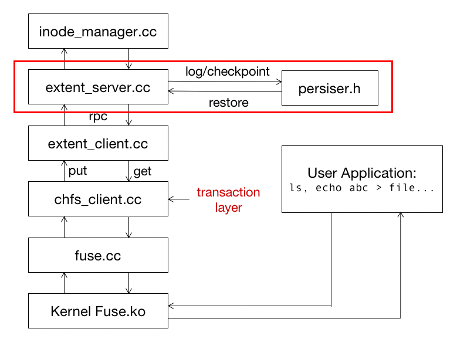

<<<<<<< HEAD
# **Lab 2A: Atomicity**

**Hand out: Oct. 20, 2022**

**Deadline: Oct. 27 23:59 (GMT+8)**

## **Introduction**

In this lab, you will learn how to achieve crash consistency in your standalone file system step by step, including:

- **Part1:** you will implement a basic persister for **data persistence**, using log mechanism to persist ChFS data into disk.
- **Part2:** you will use log mechanism to achieve **crash consistency**, i.e., each write operation(create, write, symlink…) in ChFS layer is atomic under crash condition.
- In **Part3**, you will need to implement **checkpoint** to reduce log file size.

If you have questions about this lab, either in programming environment or requirement, please ask TA **Yiwen Zhang** by email([besssszyw@gmail.com](mailto:besssszyw@gmail.com)) or Wechat.

## **Getting Started**

Please backup your solution of lab1 first.

- First, save the lab1’s solution:

  ```bash
  $ cd lab-cse
  $ git commit -a -m “solution for lab1”
  ```

- Then, pull from the repository:

  ```bash
  $ git pull
  remote: Counting objects: 43, done.
  …
  [new branch]      lab2A      -> origin/lab2A
  Already up-to-date
  ```

- Then, change to lab2 branch:

  ```bash
  $ git checkout lab2A
  ```

- Merge with lab1, and solve the conflict by yourself (probably mainly in extent_server.cc and chfs_client.cc):

  ```bash
  $ git merge lab1
  Auto-merging fuse.cc
  CONFLICT (content): Merge conflict in chfs_client.cc
  Automatic merge failed; fix conflicts and then commit the result
  ......
  ```

- After merge all of the conflicts, you should be able to compile successfully:

  ```bash
  $ make
  ```

- Make sure there's no error in make.

Note: For this lab, you will not have to worry about concurrency problems. You also need not be concerned about malicious or buggy applications.

## Transactional FileSystem

In lab1, we have implemented a basic file system on a single machine. In this lab, we will extend the file system to a transactional file system, which is robust against crashes.

Below is the architecture of our transactional filesystem in lab2A. As you see a new component named persister has been added to the system, its function is to do logging, checkpoint, and data restoration. Skeleton code of persister has been provided in file persister.h.

In our transactional filesystem, **we regard chfs_client as the transaction layer**, which means each chfs_client function(such as create, write, symlink…) should be treated as a **transaction**. Except from BEGIN and COMMIT, a transaction in ChFS usually consists of several other operations in extent_server layer. For example, the ‘create’ transaction(in chfs_client) consists of ‘create’ and ‘put’ operations(in extent_server).



- Separating persistence module from ChFS logic brings us a lot of advantages, such as better modularity, code reusability.
- Remember to persist your log and checkpoint data on disk. **And PLEASE separate your log file and checkpoint file,  put them under ‘log’ dir, name them as ‘logdata.bin’ and ‘checkpoint.bin’.**
- *You had better test your code with the previous test suit before any progress.*

## Part 1: Persistency

### **Your job**

In Part 1 your job is to use log mechanism to **persist** ChFS data into disk, and make sure data can be recovered completed after ChFS restart. The code you cope with in Part 1 is mainly in persister.h and extent_server.cc. After implementing the logging and recovering logic, your code should pass all Part 1 test scripts.

### Detailed Guidance

1. First of all, read the code and comment in persister.h carefully. In this file, we provide you with  a skeleton chfs_command class and persister class. A transaction in ChFS consists of several ChFS commands, each command corresponds to a log entry.
2. Implement chfs_command class in persister.h. A chfs_command object is a representation of a log entry, thus you may need to add transfer functions between chfs_command and string. A chfs_command object MUST contain a transaction id, other information is free to be added.
3. A chfs_command object can be used to record an extent server layer operation. In fact, there are two kinds of logs: *command log*, a redo-only log that record the parameters of the operation, so that you can redo the operation while recovering; *value log,* a redo-undo log that record the state of your system before and after the operation for undo and redo. We recommend you to implement ***value log** here*.
4. Implement function append_log and restore_logdata for persister class in persister.h. Remember to persist data into disk while logging, for crash happens anytime. And in restore_logdata, read raw binary data from disk and transfer it into ChFS command list.
5. After implementing the util tool, call logging and restoring APIs in extent_server. Make sure each operation is persisted into disk, and the data can be recovered at the next startup.

### About Test

The test in Part 1 is basic, it only crashes ChFS after a filesystem operation has done(e.g. create, write, symlink). Therefore, just focus on persistency in this part. There are 3 scripts for this part, test-lab2a-part1-a.pl, test-lab2a-part1-b.pl and test-lab2a-part1-c.sh. You can run them one by one, for example:

```bash
$ make clean && make
$ ./start.sh
starting ./chfs_client /home/stu/cse-lab/chfs1  > chfs_client1.log 2>&1 &
$ perl ./test-lab2a-part1-a.pl chfs1
create file-yyuvjztagkprvmxjnzrbczmvmfhtyxhwloulhggy-18674-0
create file-hcmaxnljdgbpirprwtuxobeforippbndpjtcxywf-18674-1
...
dircheck                                                                                                                                                 
===== ChFS Crash =====                                                                                                                                   
===== ChFS Restart =====
...
Passed all tests!
```

All three test scripts will restart ChFS for several times, each restart generates corresponding output, and follows with checks for previous filesystem operations. If test file exits without printing "Passed all tests!", then there must be something wrong with your code. If the error happens after a restart of ChFS, then check your code for logging and recovering; but if the error happens before any crash, it is probably due to your bug in lab1 code.

After passing 3 scripts one by one, run overall part 1 test scripts with:

```bash
$ make clean && make
$ ./test-lab2a-part1.sh 
starting ./chfs_client /home/stu/cse-lab/chfs1  > chfs_client1.log 2>&1 &
Passed A
Passed B
Passed C

Part1 score: 40/40
```

Now you get full score in part 1, start part 2!

## Part 2: All-or-nothing

### **Your job**

In Part 2 your job is to use log mechanism in ChFS client layer to achieve **crash consistency**, make sure each transaction(create, mkdir, write…) is atomic under crash condition.

### Detailed Guidance

Here you need to implement log logic for transaction in ChFS client. You may consider:

1. Add log API in extent server and extent client to provide log service for higher layer.
2. Call log API in ChFS client to ensure transaction atomicity.

Note that in practice, system crash may also occur when a log entry is being written to the log file. But in this lab we consider each log operation as an atomic operation, so you do not have to worry about this issue.

### About Test

The test is a little bit harder than part 1, in part 2 ChFS crashes any time, it could occur in the middle of an inode layer operation or an extent_server layer operation. In this way we can examine whether your filesystem achieves atomicity under crash conditions. There are 2 test scripts for this part, test-lab2a-part2-a.pl and test-lab2a-part2-b.pl. You can run them one by one, for example:

```bash
$ make clean && make
$ ./start.sh
starting ./chfs_client /home/stu/cse-lab/chfs1  > chfs_client1.log 2>&1 &
$ perl ./test-lab2a-part2-a.pl chfs1
create file-yyuvjztagkprvmxjnzrbczmvmfhtyxhwloulhggy-18674-0
...
===== ChFS Crash =====
test-lab2a-part2-a: cannot create chfs1/file-xerlcfysgkttqpkclweqlnsszmffexdaqwotdcfq-14912-21 due to system crash: Software caused connection abort
===== ChFS Restart =====
...
dircheck
Passed all tests!
```

All 2 test scripts will restart ChFS in the middle of filesystem operations for several times. If test file exits without printing "Passed all tests!", then there must be something wrong with your code.

After passing 2 scripts one by one, run overall part 2 test scripts with:

```bash
$ make clean && make
$ ./test-lab2a-part2.sh 
starting ./chfs_client /home/stu/cse-lab/chfs1  > chfs_client1.log 2>&1 &
Passed A
Passed B

Part1 score: 40/40
```

Now you get full score in part 2, start part 3!

## Part 3: Checkpoint

### **Your job**

In Part 3 your job is to implement **checkpoint** mechanism. Without checkpointing, log file grows indefinitely. In order to keep log file size within acceptable range, you have to use checkpoint mechanism to clear committed logs from time to time.

### Detailed Guidance

- The semantics of checkpoint in this lab is slightly different from what you learned in class. The system you learn in the class is a persistent system, every write operation is directly  write through to the disk, so a checkpoint event just clears all committed log entries. While in this lab, ChFS is a memory system, persistence is achieved through logging. Therefore, a checkpoint event not only clears the committed log entry, but also needs to persist the current state of ChFS. The data file generated by checkpoint events should be named as ‘checkpoint.bin’.
- Implement function checkpoint and restore_checkpoint for persister class in persister.h. You can either implement checkpoint by compress previous log entries, or make a snapshot of current ChFS state.
- When and how to do checkpoint is up to you, but remember to keep your log file size under **MAX_LOG_SZ**, and your checkpoint file size under **DISK_SIZE**. Also, separate your log file and checkpoint file, put them under ‘log’ dir, name them as ‘logdata.bin’ and ‘checkpoint.bin’, or your test may fail.
- Note: A *snapshot* is a record of the system state at a particular moment, it contains all the information to restore the system into the state at that moment.
- Hint: If you use snapshot in checkpoint, consider the corner case when a snapshot happens in the middle of a transaction, and the system crashes just after snapshot completed, leaving the transaction uncommitted. In this case, you may need to use value log to undo the uncommitted transaction.

### About Test

The test is fairly simple, it mainly checks the size of your log files. Log file bigger than **MAX_LOG_SZ** and checkpoint file bigger than **DISK_SIZE** will result in test failure. There are only 1 test scripts for this part, test-lab2a-part3-a.pl:

```bash
$ make clean && make
$ ./start.sh
starting ./chfs_client /home/stu/cse-lab/chfs1  > chfs_client1.log 2>&1 &
$ perl ./test-lab2a-part3-a.pl chfs1
Write and read one file: OK
...
Check directory listing: OK
===== ChFS Crash =====
Check logfile and checkpoint file size: 
        logfile xxx bytes, checkpoint xxx bytes
===== ChFS Restart =====
...
Passed all tests
```

Test script prints out your log file and checkpoint file size. If you see any error like “Logfile too big” or “Checkpoint too big”, do some optimization to control your file size.

## **GRADING**

Finally, after you've implemented all these features, run the grading script:

```bash
$ ./grade.sh
starting ./chfs_client /home/stu/cse-lab/chfs1  > chfs_client1.log 2>&1 &
Passed A
Passed B
Passed C

Part1 score: 40/40
starting ./chfs_client /home/stu/cse-lab/chfs1  > chfs_client1.log 2>&1 &
Passed A
Passed B

Part2 score: 40/40
starting ./chfs_client /home/stu/cse-lab/chfs1  > chfs_client1.log 2>&1 &
Passed A

Part3 score: 20/20
```

Note that if you encounter a **"chfs_client DIED"**, your filesystem is not working. In such cases the requests are served by the system's file system (usually EXT3 or btrfs or tmpfs). **You would not be awarded credits if your chfs_client crashes, but could get partial credit if it produces incorrect result for some test cases**. So do look out for such mistakes. **We've seen dozens of students every year thinking that they've passed lots of tests before realizing this**.

## **Handin Procedure**

After all above done:

```
$ make handin
```

That should produce a file called lab2a.tgz. Change the file name to your student id:

```
$ mv lab.tgz lab2a_[your student id].tgz
```

Then upload **lab2a_[your student id].tgz** file to [Canvas](https://oc.sjtu.edu.cn/courses/49245) before the deadline. Make sure your implementation has passed all the tests before final submit. (If you must re-submit a new version, add explicit version number such as "V2" to indicate).

You will receive full credit if your software passes the same tests we gave you when we run your software on our machines.
=======
# Lab 1: Basic File System

**Hand out: Sept 22, 2022**

**Deadline: Oct 7 23:59 (GMT+8) No Extension**

## Get Ready

In this lab, you will learn how to implement your own file system step by step. In **Part1**, you will implement an inode manager to support your file system. In **Part2**, you will start your file system implementation by getting some basic operations to work.

To do this lab, you'll need to use a computer that has the FUSE module, library, and headers installed.

We use Container (Docker) for all of your CSE Labs. Also, and we will provide a Container Image including all the environments your need for these labs. The default **username** is stu and **password** is 000. If you are not familiar with Container (Docker), read the [docker tutorial](https://docs.docker.com/get-started/) first.

## Getting Started

```bash
$ git clone https://ipads.se.sjtu.edu.cn:1312/lab/cse-2022-fall.git cse-lab -b lab1
$ chmod -R o+w cse-lab
$ docker pull shenjiahuan/cselab_env:1.0
$ sudo docker run -it --rm --privileged --cap-add=ALL -v `pwd`/cse-lab:/home/stu/cse-lab shenjiahuan/cselab_env:1.0 /bin/bash
  # now you will enter in a container environment, the codes you downloaded in cse-lab will apper in /home/stu/cse-lab in the container
$ cd cse-lab
$ make
```

**Notes:** Only files in the volume will be persistent, put all the files useful to the volume directory, in the above example: /home/stu/cse-lab directory.

If you have questions about this lab, please ask TA: Cheng Ke.

## Part 1

In this part, you will firstly implement an inode manager to support your file system, where following APIs should work properly:

```
CREATE, GETATTR
PUT, GET
REMOVE
```

Before implementing your inode manger, let's have a glance at the ChFS architecture:


In part 1, you can completely ignore the fuse and chfs_client, but just concern about the parts framed by the red box: **extent_client**, **extent_server** and **inode_manager**.

Extent_client acts as a block provider just like a disk. It will communicate with extent_server using rpc (which you will implement in the future, just now it only uses direct and local function call).

The inode manager mimics the inode layer of alloc_inode, free_inode, read_file, write_file, remove_file, get_attr, which support the five APIs (**CREATE/GETATTR/PUT/GET/REMOVE**) provided by extent_server.

If there's no error in make, an executable file part1_tester will be generated, and after you type:

```bash
$ ./part1_tester
```

you will get following output:

```
========== begin test create and getattr ==========
...
[TEST_ERROR]: error ...
--------------------------------------------------
Part1 score is : 0/100
```

If you see additional warnings/errors, it's most likely because you don't have some specific libraries installed. Usethe apt-file utility to look up the correct package that contains the file you need, if you are on debian-based system.

**Part 1** will be divided into 3 parts. Before you write any code, we **suggest** that you should read **inode_manager.h** first and be familiar with all the classes. We have already provide you some useful functions such as get_inode and put_inode.

In **part 1A**, you should implement disk::read_block, disk::write_block, inode_manager::alloc_inode, inode_manager::get_inode and inode_manager::get_attr, to support **CREATE** and **GETATTR** APIs. Your code should pass the **test_create_and_getattr()** in part1_tester, which tests creating empty files, getting their attributes like type.

In **part 1B**, you should implement inode_manager::write_file, inode_manager::read_file, block_manager::alloc_block, block_manager::free_block, to support **PUT** and **GET** APIs. Your code should pass the **test_put_and_get()** in part1_tester, which, write and read files.

In **part 1C**, you should implement inode_manager::remove_file and inode_manager::free_inode, to support **REMOVE** API. Your code should pass the **test_remove()** in part1_tester.

In part 1, you should only need to make changes to inode_manager.cc. (Although you are allowed to change many other files, except those directly used to implement tests.) Although maybe we won't check all the corner case, you should try your best to make your code **robust**. It will be good for the coming labs.

### Part 1A: CREATE/GETATTR

Your job in Part 1A is to implement the read_block and write_block of disk and the alloc_inode, get_inode and get_attr of inode_manager, to support the **CREATE** and **GETATTR** APIs of extent_server. You may modify or add any files you like, except that you should not modify the part1_tester.cc. (Although our sample solution, for lab1-part-1, contains changes to inode_manager.cc only.)

The tips can be found on the codes of inode_manager.[h|cc]. Be aware that you should firstly scan through the code in inode_manager.h, where defines most of the variables, structures and macros you can use, as well as the functions get_inode and put_inode of inode_manager I leave to you to refer to.

Meanwhile, pay attention to one of the comments in inode_manager.cc:

```
// The layout of disk should be like this:
// |<-sb->|<-free block bitmap->|<-inode table->|<-data->|
```

It may be helpful for you to understand most of the process of the data access. After you finish these 4 functions implementation, run:

```bash
$ make
$ ./part1_tester
```

You should get following output:

```
========== begin test create and getattr ==========
...
...
========== pass test create and getattr ==========
========== begin test put and get ==========
...
...
[TEST_ERROR] : error ...
--------------------------------------------------
Part1 score is : 40/100
```

### Part 1B: PUT/GET

Your job in Part 1B is to implement the write_file and read_file of inode_manager, and alloc_block and free_block of block_manager, to support the **PUT** and **GET** APIs of extent_server.

You should pay attention to the indirect block test. In our inode manager, each file has only one additional level of indirect block, which means one file has 100 direct block and 1 indirect block which point to a block filled with other blocks id.

After you finish these 4 functions implementation, run:

```bash
$ make
$ ./part1_tester
```

You should get following output:

```
========== begin test create and getattr ==========
...
...
========== pass test create and getattr ==========
========== begin test put and get ==========
...
...
========== pass test put and get ==========
========== begin test remove ==========
...
...
[TEST_ERROR] : error ...
--------------------------------------------------
Part1 score is : 70/100
```

### Part 1C: REMOVE

Our job in Part 1C is to implement the remove_file and free_inode of inode_manager, to support the **REMOVE**API of extent_server.

After you finish these 2 functions implementation, run:

```bash
$ make
$ ./part1_tester
```

You should get following output:

```
========== begin test create and getattr ==========
...
...
========== pass test create and getattr ==========
========== begin test put and get ==========
...
...
========== pass test put and get ==========
========== begin test remove ==========
...
...
========== pass test remove ==========
========== begin test indirect ==========
...
...
========== pass test indirect ==========
--------------------------------------------------
Part1 score is : 100/100
```

## Part 2

In Part 2, you will start your file system implementation by getting the following FUSE operations to work:

```
CREATE/MKNOD, LOOKUP, and READDIR
SETATTR, WRITE and READ
MKDIR and UNLINK
SIMBOLIC LINK
```

(For your own convenience, you may want to implement rmdir to facilitate your debugging/testing.) 

At first, let's review the ChFS architecture:


In part 2, what you should concern about are the parts framed by the red box above: **FUSE** and **ChFS** client.

The **FUSE** interface, in **fuse.cc**. It translates FUSE operations from the FUSE kernel modules into ChFS client calls. We provide you with much of the code needed to register with FUSE and receive FUSE operations. We have implemented all of those methods for you except for Symbol Link. So don't modify **fuse.cc** unless you want to implement **Symbol Link**.

The **ChFS client**, in **chfs_client.{cc,h}**. The ChFS client implements the file system logic. For example, when creating a new file, your chfs_client will add directory entries to a directory block.

We provide you with the script **start.sh** to automatically start **chfs_client**, and stop.sh to kill previously started processes. Actually, **start.sh** starts one **chfs_client** with **./chfs1** mountpoint. Thus you can type:

```bash
$ make
$ sudo ./start.sh
$ sudo ./test-lab1-part2-a.pl ./chfs1
$ sudo ./test-lab1-part2-b.pl ./chfs1
$ sudo ./stop.sh
```

**Note 1**: Since you need to mount fuse file system, so you should add **sudo** to above commands;

**Note 2**: If **stop.sh** reports "Device or resource busy", please **keep executing stop.sh** until it says "not found in /etc/mtab", such as:

```
fusermount: entry for /home/stu/cse-lab/chfs1 not found in /etc/mtab
...
```

**Part 2** will be divided into **4 parts**:

At the beginning, it will be helpful to scan the **interfaces** and **structs** in **chfs_client.h** and some other files. The functions you have implemented in part 1 are the fundament of this part.

### Part 2A: CREATE/MKNOD, LOOKUP, and READDIR

**Your job**

In Part 2A your job is to implement the **CREATE/MKNOD**, **LOOKUP** and **READDIR** of **chfs_client.cc** in ChFS. You may modify or add any files you like, except that you should not modify the test scripts. Your code should pass the **test-lab1-part2-a.pl** script, which tests creating empty files, looking up names in a directory, and listing directory contents.

On some systems, FUSE uses the MKNOD operation to create files, and on others, it uses CREATE. The two interfaces have slight differences, but in order to spare you the details, we have given you wrappers for both that call the common routine **createhelper()**. You can see it in **fuse.cc**.

As before, if your ChFS passes our tester, you are done. If you have questions about whether you have to implement specific pieces of file system functionality, then you should be guided by the tester: if you can pass the tests without implementing something, then you do not have to implement it. For example, you don't need to implement the exclusive create semantics of the CREATE/MKNOD operation.

**Detailed Guidance**

1. When creating a new file (fuseserver_createhelper) or directory (fuseserver_mkdir), you must assign a unique inum (which you’ve done in part1).

   **Note**: Though you are free to choose any inum identifier you like for newly created files, FUSE assumes that the inum for the root directory is 0x00000001. Thus, you'll need to ensure that when chfs_client starts, it is ready to export an empty directory stored under that inum.

2. Directory format: Next, you must choose the **format for directories**. A directory's content contains a set of name to inode number mappings. You should store a directory's entire content in a directory (recall what you learned). A simple design will make your code simple. You may refer to the **FAT32** specification or the EXT inode design (http://en.wikipedia.org/wiki/Inode_pointer_structure) for an example to follow. **Note**: As is mentioned in Wikipedia (http://en.wikipedia.org/wiki/Ext3), the EXT3 filesystem which we go after supports any characters but '\0' and '/' in the filename. Make sure your code passes when there's '$', '_', ' ', etc, in the filename.

3. FUSE:When a program (such as ls or a test script) manipulates a file or directory (such as chfs1) served by your **chfs_client**, the FUSE code in the kernel sends corresponding operations to chfs_client via FUSE. The code we provide you in **fuse.cc** responds to each such operation by calling one of a number of procedures, for create, read, write, etc. operations. You should modify the relevant routines in fuse.cc to call methods in **chfs_client.cc**. **fuse.cc** should just contain glue code, and the core of your file system logic should be in **chfs_client.cc**. For example, to handle file creation, fuseserver_createhelper to call chfs->create(...), and you should complete the create(...) method to **chfs_client.cc**. Look at getattr() in **fuse.cc** for an example of how a fuse operation handler works, how it calls methods in **chfs_client**, and how it sends results and errors back to the kernel. ChFS uses FUSE's "lowlevel" API.

4. ChFS code:The bulk of your file system logic should be in **chfs_client**, for the most part in routines that correspond to fuse operations (create, read, write, mkdir, etc.). Your **fuse.cc** code should pass inums, file names, etc. to your **chfs_client** methods. Your **chfs_client** code should retrieve file and directory contents from the extent client with get(), using the inum as the extent ID. In the case of directories, your **chfs_client**code should parse the directory content into a sequence of name/inum pairs (i.e. chfs_client::dirents), for lookups, and be able to add new name/inum pairs.

5. A reasonable way to get going on **fuss.cc** is to run **test-lab1-part2-a.pl**, find the function in fuse.cc whose missing implementation is causing the tester to fail, and start fixing that function. Look at the end of **chfs_client1.log** and/or add your own print statements to **fuse.cc**. If a file already exists, the CREATE operator (fuseserver_create and fuseserver_mknod) should return EEXIST to FUSE.

6. **start.sh** redirects the STDOUT and STDERR of the servers to files in the current directory. For example, any output you make from **fuse.cc** will be written to chfs_client1.log. Thus, you should look at these files for any debug information you print out in your code.

7. If you wish to test your code with only some of the FUSE hooks implemented, be advised that FUSE may implicitly try to call other hooks. For example, FUSE calls LOOKUP when mounting the file system, so you may want to implement that first. FUSE prints out to the **chfs_client1.log** file the requests and results of operations it passes to your file system. You can study this file to see exactly what hooks are called at every step.

**About Test**

The Lab tester for Part 2A is **test-lab1-part2-a.pl**. Run it with your ChFS mountpoint as the argument. Here's what a successful run of **test-lab1-part2-a.pl** looks like:

```bash
$ make
$ sudo ./start.sh
starting ./chfs_client /home/stu/cse-lab/chfs1  > chfs_client1.log 2>&1 &
$ sudo ./test-lab1-part2-a.pl ./chfs1
create file-yyuvjztagkprvmxjnzrbczmvmfhtyxhwloulhggy-18674-0
create file-hcmaxnljdgbpirprwtuxobeforippbndpjtcxywf-18674-1
...
Passed all tests!
```

The tester creates lots of files with names like file-XXX-YYY-Z and checks that they appear in directory listings.

If **test-lab1-part2-a.pl** exits without printing "Passed all tests!", then it thinks something is wrong with your file server. For example, if you run **test-lab1-part2-a.pl** on the skeleton code we give you, you'll probably see some error message like this:

```
test-lab1-part2-a: cannot create /tmp/b/file-ddscdywqxzozdoabhztxexkvpaazvtmrmmvcoayp-21501-0 :
    No such file or directory
```

This error message appears because you have not yet provided code to handle the CREATE/MKNOD operation with FUSE. That code belongs in fuseserver_createhelper in **fuse.cc**.

**Note**: testing Part 2A on the command line using commands like touch will not work until you implement the SETATTR operation in Part 2B. For now, you should do your testing via the creat/open, lookup, and readdir system calls in a language like Perl, or simply use the provided test script.

**Note**: if you are sure that there is not any mistake in your implementation for part1 and still cannot pass this test, maybe there are some **bugs in your part1**, especially read_file and write_file. Remeber that passing the test do not guarantee completely correct.

### Part 2B: SETATTR, READ, WRITE

**Your job**

In Part 2B your job is to implement SETATTR, WRITE, and READ FUSE operations in **fuse.cc** and **chfs_client.cc**. Once your server passes **test-lab1-part2-b.pl**, you are done. Please don't modify the test program or the RPC library. We will use our own versions of these files during grading.

**Detailed Guidance**

1. Implementing SETATTR. The operating system can tell your file system to set one or more attributes via the FUSE SETATTR operation. See [fuse_lowlevel.h](https://sourceforge.net/u/noon/fuse/ci/ecd073bd7054c9e13516041e3ef930e39270c8df/tree/include/fuse_lowlevel.h) for the relevant definitions. The **to_set** argument to your SETATTR handler is a mask that indicates which attributes should be set. There is really only one attribute (the file size attribute) you need to pay attention to (but feel free to implement the others if you like), indicated by bit **FUSE_SET_ATTR_SIZE**. Just AND (i.e., &) the to_set mask value with an attribute's bitmask to see if the attribute is to be set. The new value for the attribute to be set is in the attar parameter passed to your SETATTR handler. The operating system may implement overwriting an existing file with a call to SETATTR (to truncate the file) rather than CREATE. Setting the size attribute of a file can correspond to truncating it completely to zero bytes, truncating it to a subset of its current length, or even padding bytes on to the file to make it bigger. Your system should handle all these cases correctly.
2. Implementing READ/WRITE:A read (fuseserver_read) wants up to size bytes from a file, starting from a certain offset. When less than size bytes are available, you should return to fuse only the available number of bytes. See the manpage for read(2) for details. For writes (fuseserver_write), a non-obvious situation may arise if the client tries to write at a file offset that's past the current end of the file. Linux expects the file system to return '\0's for any reads of unwritten bytes in these "holes" (see the manpage for [lseek(2)](http://man7.org/linux/man-pages/man2/lseek.2.html) for details). Your write should handle this case correctly.

**About Test**

**test-lab1-part2-b.pl** tests reading, writing, and appending to files. To run the tester, first start one chfs_client using the **start.sh** script.

```bash
$ make
$ sudo ./start.sh
```

Now run test-lab1-part2-b.pl by passing the chfs1 mountpoint.

```bash
$ sudo ./test-lab1-part2-b.pl ./chfs1
Write and read one file: OK
Write and read a second file: OK
Overwrite an existing file: OK
Append to an existing file: OK
Write into the middle of an existing file: OK
Check that one cannot open non-existant file: OK
Check directory listing: OK
Passed all tests

$ sudo ./stop.sh
```

If **test-lab1-part2-b.pl** exits without printing "Passed all tests!" or hangs indefinitely, then something is wrong with your file server. After you are done with Part 2, you should go back and test with **test-lab1-part2-a.pl**again to make sure you did not break anything.

### Part 2C: MKDIR and UNLINK

**Your job**

In Part 2C your job is to handle the MKDIR and UNLINK FUSE operations. For MKDIR, you do not have to create "." or ".." entries in the new directory since the Linux kernel handles them transparently to ChFS. UNLINK should always free the file's extent; you do not need to implement UNIX-style link counts.

**About Test** If your implementation passes the **test-lab1-part2-c.pl** script, you are done with part 3. The test script creates a directory, creates and deletes lots of files in the directory, and checks file and directory mtimes and ctimes. **Note** that this is the first test that explicitly checks the correctness of these time attributes. A create or delete should change both the parent directory's mtime and ctime (here you should decide which level you can **modify the 3 time attributes**, and think about why?). Here is a successful run of the tester:

```bash
$ make
$ sudo ./start.sh
$ sudo ./test-lab1-part2-c.pl ./chfs1
mkdir ./chfs1/d3319
create x-0
delete x-0
create x-1
checkmtime x-1
...
delete x-33
dircheck
Passed all tests!
$ sudo ./stop.sh
```

**Note**: Now run the command sudo ./grade and you should pass A, B, C and E.

### Part 2D: SYMLINK, READLINK

Please implement symbolic link. To implement this feature, you should refer to the FUSE documentation available online and figure out the methods you need to implement. It's all on yourself. Also, look out for comments and hints in the hand-out code. **Note**: remember to add related method to fuse.cc. You may want to refer to http://stackoverflow.com/questions/6096193/how-to-make-symbolic-links-in-fuse .

## GRADING

Finally, after you've implemented all these features, run the grading script:

```bash
$ sudo ./grade.sh
Passed A
Passed B
Passed C
Passed D
Passed E
Passed F -- Robustness
Part2 score: 100/100
```

Note that if you encounter a **"chfs_client DIED"**, your filesystem is not working. In such cases the requests are served by the system's file system (usually EXT3 or btrfs or tmpfs). **You would not be awarded credits if your chfs_client crashes, but could get partial credit if it produces incorrect result for some test cases**. So do look out for such mistakes. **We've seen dozens of students every year thinking that they've passed lots of tests before realizing this**.

## Handin Procedure

After all above done:

```bash
$ make handin
```

That should produce a file called lab1.tgz. Change the file name to your student id:

```
$ mv lab.tgz lab1_[your student id].tgz
```

Then upload **lab1\_[your student id].tgz** file to [Canvas](https://oc.sjtu.edu.cn/courses/49245) before the deadline. Make sure your implementation has passed all the tests before final submit. (If you must re-submit a new version, add explicit version number such as "V2" to indicate).

You will receive full credit if your software passes the same tests we gave you when we run your software on our machines.
>>>>>>> lab1
